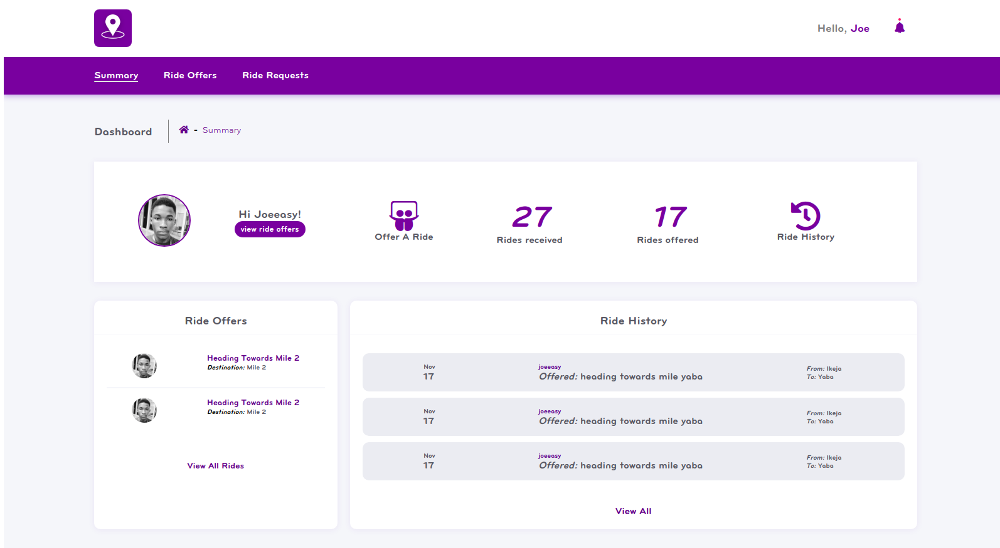

# Ride My Way

Ride-my App is a carpooling application that provides drivers with the ability to create ride offers
and passengers to join available ride offers.

# Motivation

This App is a challenge that will contritube greatly to my journey of becoming a world class developer

# Build Status

Build status of continous integration i.e travis, coveralls and codeclimate

[](https://travis-ci.org/joeeasy/Ride-my-way)
[](https://coveralls.io/github/joeeasy/Ride-my-way?branch=develop)
[](https://codeclimate.com/github/joeeasy/Ride-my-way/maintainability)
[](https://codeclimate.com/github/joeeasy/Ride-my-way/test_coverage)
[](https://codecov.io/gh/joeeasy/Ride-my-way)
### Style guide

[Airbnb ](https://github.com/airbnb/javascript)(Javascript style guide)
[BEM ](https://github.com/airbnb/css)(CSS style guide)

### Screenshots(UI template)



Preview UI template here[ UI Template](https://joeeasy.github.io/Ride-my-way/UI/)

### Tech Stack

- [Nodejs](https://nodejs.org/en/)
- [Expressjs](https://expressjs.com/)
- [Mocha](https://mochajs.org/)
- [Chai](http://www.chaijs.com/)

### Features

- User should be able to create account
- User should be able to view all ride offers
- User should be able to see the details of a ride offer and respond to it
- User should be able to offer a ride
- user should be able to view and accept requests for the ride offers he/she has created

## Installing

#### Prerequisites

Ensure you have **NodeJS** installed by entering `node -v` on your terminal
If you don't have **NodeJS** installed go to the [NodeJS Website](http://nodejs.org), and follow the download instructions

To install this app

```
git clone git@github.com:joeeasy/Ride-my-way.git
```

And install the required dependencies

```
npm install
```

Run server

```
npm run dev
```

Server listens on port `5000`

## Running the tests

To run test cases

```
npm test
```

### Working Routes

<table>
<thead>
<tr>
<th>Endpoint</th>
<th>Functionality</th>
</tr>
</thead>
<tbody>
<tr>
<td>GET api/v1/rides</td>
<td>Fetch all ride request for an authenticated user</td>
</tr>
<tr>
<td>GET api/v1/users/:requestId</td>
<td>Fetch the details of a specific ride</td>
</tr>
<tr>
<td>POST api//users/rides</td>
<td>Creates a new ride offer</td>
</tr>
<tr>
<td>POST api/v1/users/:rideId/requests</td>
<td>Sends a request to join a new ride</td>
</tr>
</tbody></table>

## License

This projects is under the MIT LICENSE

## Author

[Jehonadab Okpukoro](http://github.com/joeeasy)

## Acknowledgments

- [Andela](http://andela.com)
- [Brad Traversy Media](https://www.youtube.com/channel/UC29ju8bIPH5as8OGnQzwJyA)
- [Google Search](https://google.com)
- [Stackoverflow](stackoverflow.com)
- Hat tip to everybody who supported

### Live demo

You can test the api endpoints

- [Here ](https://ridemw.herokuapp.com/)
